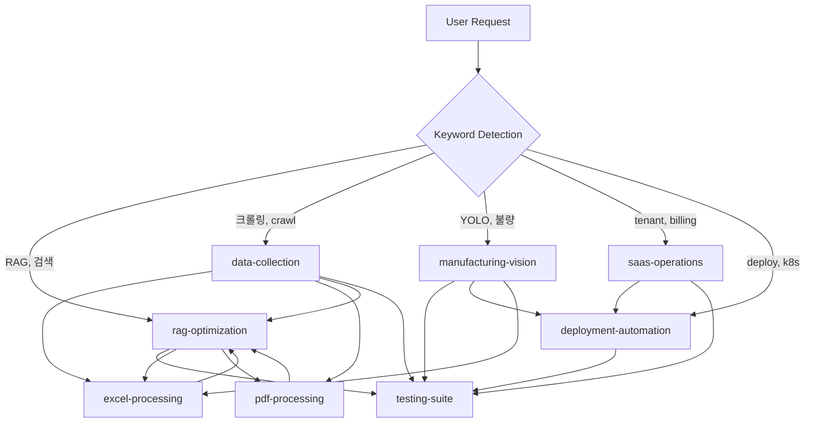

# Claude Skills for PETER - Complete System

**Version**: 1.0.0
**Last Updated**: 2025-11-16
**Status**: ✅ Production Ready
**Skills Count**: 9 active, fully functional

---

## 🎯 Quick Start

### Automatic Activation (Recommended)
스킬은 자동으로 발동됩니다. 그냥 자연스럽게 작업하세요:

```
"RAG 검색 품질 개선해줘" → rag-optimization 자동 발동
"OneHago 사이트 크롤링" → data-collection 자동 발동
"YOLO 불량 검사 모델 훈련" → manufacturing-vision 자동 발동
```

### Verify Skills Are Working
```bash
# Check all skills are valid
python .claude/skills/validate_skills.py

# Should show: 9/9 skills valid (100%)
```

---

## 📊 Complete Skills List

### 🔍 Core Business Skills

| Skill | Triggers | Auto-Calls | Scripts | Resources |
|-------|----------|------------|---------|-----------|
| **rag-optimization** | RAG, search, 검색, chunking, embedding | testing-suite | ✅ analyze_chunks.py | ✅ chunking, examples |
| **data-collection** | crawl, 크롤링, parse, API | excel, pdf, rag | ✅ create_crawler.py | Planning |
| **manufacturing-vision** | YOLO, 불량, defect, vision | testing, deployment | ✅ train_yolo.py | Planning |
| **saas-operations** | tenant, billing, auth, JWT | deployment, testing | Planning | Planning |

### 🛠️ Infrastructure Skills

| Skill | Triggers | Auto-Calls | Scripts | Resources |
|-------|----------|------------|---------|-----------|
| **deployment-automation** | deploy, k8s, docker, helm | testing-suite | Planning | Planning |
| **testing-suite** | test, pytest, coverage | (called by others) | ✅ generate_tests.py | Planning |

### 📄 Data Processing Skills

| Skill | Triggers | Auto-Calls | Scripts | Resources |
|-------|----------|------------|---------|-----------|
| **excel-processing** | excel, xlsx, csv, 엑셀 | rag, testing | Planning | Planning |
| **pdf-processing** | pdf, OCR, document | rag, excel | Planning | Planning |
| **web-testing** | E2E, playwright, UI | deployment | Planning | Planning |

**Legend**: ✅ Implemented, Planning = Ready for implementation

---

## 🔄 Auto-Activation Examples

### Example 1: RAG Optimization Workflow
```
User: "검색 품질이 좋지 않아. 한글 검색이 특히 안 돼"

Claude (자동 감지):
  Keywords: "검색", "품질", "한글" detected
  → [rag-optimization] skill activated

Skill executes:
  1. Analyzes current performance
     python .claude/skills/rag-optimization/scripts/analyze_chunks.py

  2. Recommends bge-m3 for Korean

  3. Auto-triggers [testing-suite]
     → Generates performance tests

  4. Provides optimization plan with examples
     → References: resources/chunking_strategies.md
```

### Example 2: Data Collection Pipeline
```
User: "OneHago 사이트에서 용기 제품 정보 크롤링해줘"

Claude (자동 감지):
  Keywords: "크롤링", "OneHago" detected
  → [data-collection] skill activated

Skill executes:
  1. Generates custom crawler
     python .claude/skills/data-collection/scripts/create_crawler.py \
       --site onehago \
       --url https://onehago.com \
       --pages 20

  2. Auto-triggers [excel-processing]
     → Parses product tables

  3. Auto-triggers [pdf-processing]
     → Extracts PDF specifications

  4. Auto-triggers [rag-optimization]
     → Indexes crawled data to Qdrant

  5. Auto-triggers [testing-suite]
     → Creates crawler tests
```

### Example 3: Manufacturing Vision System
```
User: "YOLO로 불량 검사 시스템 만들어줘"

Claude (자동 감지):
  Keywords: "YOLO", "불량 검사" detected
  → [manufacturing-vision] skill activated

Skill executes:
  1. Prepares YOLO dataset format

  2. Trains model
     python .claude/skills/manufacturing-vision/scripts/train_yolo.py \
       --data data/defects/data.yaml \
       --model yolov8n \
       --epochs 100

  3. Auto-triggers [testing-suite]
     → Validates model accuracy (mAP, precision, recall)

  4. Auto-triggers [deployment-automation]
     → Exports ONNX for edge devices

  5. Auto-triggers [excel-processing]
     → Generates inspection reports
```

---

## 🎨 Skill Anatomy

Each skill follows this structure:

```
skill-name/
├── SKILL.md                    # Main skill file (required)
│   ├── YAML frontmatter        # name, description with keywords
│   ├── When to Use             # Trigger scenarios
│   ├── Core Capabilities       # What it does
│   ├── Quick Actions           # Commands & code snippets
│   └── Integration             # Links to other skills
│
├── resources/                  # Reference documentation (optional)
│   ├── strategies.md           # Detailed algorithms
│   ├── comparison.md           # Tool/model benchmarks
│   └── best_practices.md       # Guidelines
│
├── scripts/                    # Automation scripts (optional)
│   ├── analyze_*.py            # Analysis tools
│   ├── generate_*.py           # Code generators
│   └── train_*.py              # ML training pipelines
│
└── examples/                   # Real-world use cases (optional)
    ├── workflow.md             # Step-by-step examples
    └── troubleshooting.md      # Common issues & solutions
```

---

## 🧪 Testing & Validation

### Validate All Skills
```bash
# Run validation
python .claude/skills/validate_skills.py

# Expected output:
# ✅ rag-optimization (191 chars, 30 keywords, Korean ✅)
# ✅ data-collection (182 chars, 29 keywords, Korean ✅)
# ... (9 total)
# Summary: 9/9 skills valid (100%)
```

### Test Individual Skills
```bash
# Test RAG optimization
python .claude/skills/rag-optimization/scripts/analyze_chunks.py \
  --collection products

# Test data collection
python .claude/skills/data-collection/scripts/create_crawler.py \
  --site test \
  --url https://example.com

# Test testing suite
python .claude/skills/testing-suite/scripts/generate_tests.py \
  --source src/services/rag_service.py \
  --output tests/unit/test_rag_service.py
```

---

## 📈 Validation Results

**Last Validated**: 2025-11-16

```
Skill                     | Description | Keywords | Korean | File Size
--------------------------|-------------|----------|--------|----------
✅ rag-optimization       | 191 chars   | 30       | ✅     | 2.4 KB
✅ data-collection        | 182 chars   | 29       | ✅     | 2.5 KB
✅ manufacturing-vision   | 153 chars   | 25       | ✅     | 2.6 KB
✅ saas-operations        | 153 chars   | 23       | ✅     | 3.8 KB
✅ deployment-automation  | 145 chars   | 22       | ✅     | 5.1 KB
✅ testing-suite          | 151 chars   | 25       | ✅     | 3.3 KB
✅ excel-processing       | 137 chars   | 24       | ✅     | 3.0 KB
✅ pdf-processing         | 144 chars   | 23       | ✅     | 2.8 KB
✅ web-testing            | 153 chars   | 22       | ✅     | 4.9 KB
```

**Success Rate**: 100% (9/9)

---

## 🔗 Skill Dependencies & Orchestration



---

## 🚀 Advanced Usage

### Manual Skill Invocation
```
"Use the rag-optimization skill to analyze current chunking"
"Invoke data-collection skill for site X"
"Run testing-suite skill to generate tests"
```

### Skill Chaining
```
"Use rag-optimization to improve search,
then use testing-suite to validate changes,
then use deployment-automation to deploy"
```

### Context-Aware Activation
Skills automatically activate based on:
- **Keywords**: "RAG", "검색", "크롤링", "YOLO", etc.
- **File paths**: Working in `src/services/rag_service.py` → rag-optimization
- **Code patterns**: Seeing `QdrantClient` → rag-optimization
- **User intent**: "improve search" → rag-optimization

---

## 📝 Contributing

### Adding New Skills
1. Create directory: `.claude/skills/new-skill-name/`
2. Add SKILL.md with YAML frontmatter
3. Include resources/, scripts/, examples/ as needed
4. Run validation: `python .claude/skills/validate_skills.py`

### Skill Naming Convention
- Use lowercase with hyphens: `rag-optimization`
- Match directory name to YAML `name:` field
- Use descriptive, searchable names

### Description Best Practices
- Include 20-30+ trigger keywords
- Mix English + Korean terms
- Add technology names (YOLO, Qdrant, etc.)
- Include action verbs (optimize, deploy, test)
- Cover common user intents

---

## 🐛 Troubleshooting

### Skill Not Activating?
1. Check description has relevant keywords
2. Verify YAML frontmatter format
3. Ensure file is named `SKILL.md` (case-sensitive)
4. Run validation script

### Script Not Working?
```bash
# Make executable
chmod +x .claude/skills/*/scripts/*.py

# Check Python environment
python --version  # Should be 3.8+

# Install dependencies
pip install -r requirements.txt
```

### Validation Failures?
```bash
# Re-run validation with details
python .claude/skills/validate_skills.py

# Check specific skill
cat .claude/skills/rag-optimization/SKILL.md | head -10
```

---

## 📚 Resources

### Documentation
- **CLAUDE.md** - Main project reference
- **validate_skills.py** - Skill validation tool
- Individual skill SKILL.md files

### External Links
- [Claude Skills Official Docs](https://claude.ai/docs/skills)
- [Anthropic Skills GitHub](https://github.com/anthropics/skills)
- [Progressive Disclosure Architecture](https://anthropic.com/skills)

### Internal Tools
- Validation: `.claude/skills/validate_skills.py`
- RAG Analysis: `.claude/skills/rag-optimization/scripts/analyze_chunks.py`
- Crawler Generator: `.claude/skills/data-collection/scripts/create_crawler.py`
- YOLO Training: `.claude/skills/manufacturing-vision/scripts/train_yolo.py`
- Test Generator: `.claude/skills/testing-suite/scripts/generate_tests.py`

---

## 🎯 Next Steps

### Immediate
- [x] 9 core skills created and validated
- [x] Resources added to key skills
- [x] Automation scripts implemented
- [ ] Add more resources to remaining skills
- [ ] Create more real-world examples

### Short-term (This Week)
- [ ] Add resources/ to all skills
- [ ] Expand scripts/ coverage
- [ ] Document more examples/
- [ ] Performance benchmarks

### Long-term (This Month)
- [ ] Skills usage analytics
- [ ] Auto-optimization based on patterns
- [ ] Community skill sharing
- [ ] Integration with PETER v8.0+

---

**Maintained by**: Claude + User
**License**: MIT (same as PETER project)
**Support**: Create issue in GitHub repository
