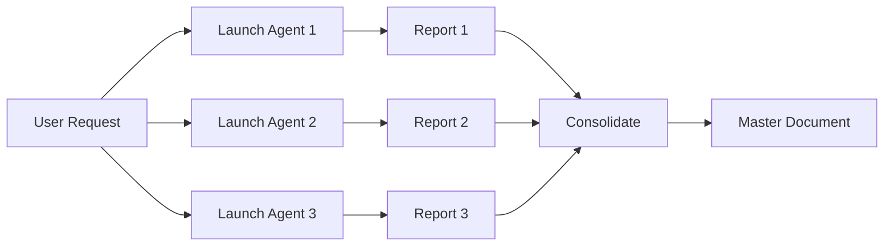
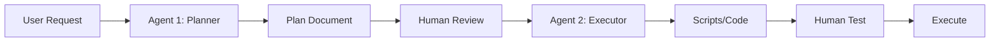
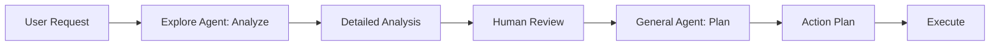
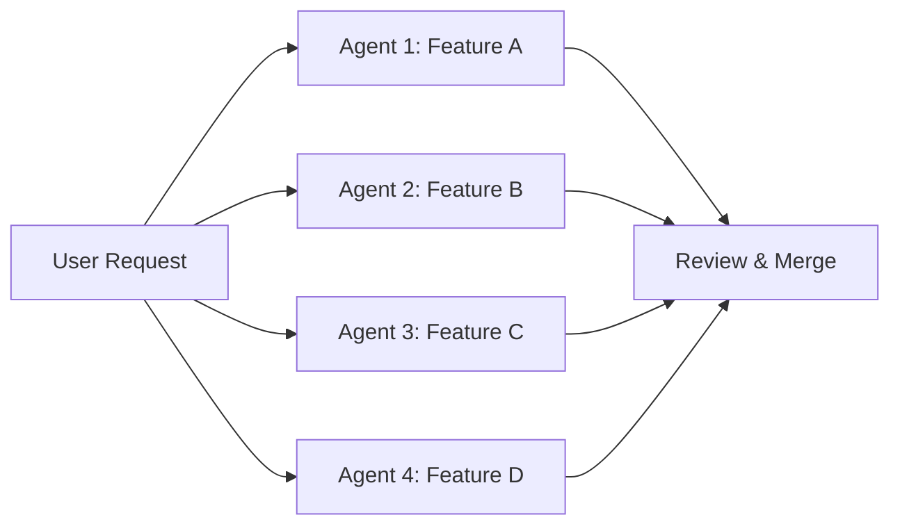

# Sub-Agents Collaboration Plan
**Project**: RAG Enterprise v10.0.0 "Unified"
**Date**: 2025-11-15
**Purpose**: Strategic use of Claude Code sub-agents for comprehensive integration
**Scope**: Backend + Frontend + File Structure Migration

---

## 📋 Executive Summary

This document outlines the **strategic collaboration plan** for using Claude Code sub-agents throughout the v10.0.0 "Unified" integration project. Sub-agents enable parallel processing, specialized expertise, and efficient handling of large-scale refactoring tasks.

### Available Sub-Agents

| Agent Type | Specialization | Primary Tools | Best For |
|------------|----------------|---------------|----------|
| **general-purpose** | Multi-step tasks, planning, automation | All tools | Planning, script generation, complex workflows |
| **Explore** | Codebase analysis, pattern discovery | Glob, Grep, Read, MCP Serena | Code exploration, duplication analysis, dependency mapping |
| **Plan** | Fast codebase exploration, planning | Glob, Grep, Read | Quick analysis, architectural planning |

### Sub-Agent Usage Strategy

**Principle**: Use sub-agents for **parallelizable**, **specialized**, or **large-scope** tasks that would otherwise consume significant conversation context.

**Don't Use**: For simple file reads, single edits, or tasks requiring frequent user interaction.

---

## 🎯 Sub-Agent Collaboration Map

### Phase 1: Discovery & Analysis (Week 1)

#### Agent Deployment Pattern: 3 Parallel Explore Agents

**Context**: Initial codebase analysis for both backend and frontend.

**Agent 1: Backend Duplication Analysis**
- **Type**: Explore (medium thoroughness)
- **Task**: Analyze app/ vs src/ duplication
- **Deliverables**:
  - Symbol-by-symbol comparison (config.py, services/, middleware/)
  - Import dependency graph
  - Unique features list (app/ vs src/)
  - Migration priority matrix

**Agent 2: Frontend Structure Analysis** ✅ COMPLETED
- **Type**: Explore (medium thoroughness)
- **Task**: Analyze frontend-v2/ vs apps/web/ duplication
- **Deliverables**: ✅ Delivered
  - File-by-file comparison
  - Component duplication matrix
  - Legacy HTML features inventory
  - Package structure analysis

**Agent 3: Configuration Analysis**
- **Type**: Explore (quick)
- **Task**: Analyze all config files (.claudeignore, mcp.json, turbo.json, etc.)
- **Deliverables**:
  - Token waste analysis
  - Configuration inconsistencies
  - Optimization recommendations
  - MCP server usage patterns

**Coordination**:
```bash
# Launch all 3 agents in parallel (single message, 3 Task calls)
# Wait for all results
# Consolidate findings into master analysis document
```

**Expected Output**:
- 3 detailed reports (~1,000 lines each)
- Combined insights document
- Prioritized migration backlog

---

### Phase 2: Backend Unification (Week 2-3)

#### Agent Deployment Pattern: 1 General-Purpose + 1 Explore

**Context**: Migrate src/ → backend/ with import updates.

**Agent 1: Backend Migration Planner** ✅ COMPLETED
- **Type**: general-purpose
- **Task**: Create detailed backend migration plan
- **Deliverables**: ✅ Delivered
  - BACKEND_MIGRATION_PLAN.md
  - 4 executable scripts (00-03)
  - Validation strategy
  - Rollback procedures

**Agent 2: Import Dependency Mapper**
- **Type**: Explore (very thorough)
- **Task**: Map all import statements across 316 Python files
- **Deliverables**:
  - Import graph (who imports what)
  - Circular dependency detection
  - External package usage (which files import requests, fastapi, etc.)
  - Suggested refactoring (break circular deps)

**Coordination**:
```bash
# Sequential execution
# 1. Planner creates migration strategy
# 2. Mapper analyzes current state to validate plan
# 3. Manual review of findings
# 4. Execute migration scripts
```

**User Interaction Points**:
- After Agent 1: Review migration plan
- After Agent 2: Review import graph, approve refactoring suggestions
- Before execution: Final approval

---

### Phase 3: Frontend Consolidation (Week 4-5)

#### Agent Deployment Pattern: 2 General-Purpose Agents

**Context**: Move components to packages/ui, extract services to packages/core.

**Agent 1: Component Extractor** ✅ COMPLETED
- **Type**: general-purpose
- **Task**: Create frontend integration plan
- **Deliverables**: ✅ Delivered
  - FRONTEND_FILE_STRUCTURE_PLAN.md (3,415 lines)
  - 10 executable migration scripts
  - Component templates
  - Service templates

**Agent 2: Script Generator**
- **Type**: general-purpose
- **Task**: Generate executable migration scripts for Phase 3
- **Input**: FRONTEND_FILE_STRUCTURE_PLAN.md (from Agent 1)
- **Deliverables**:
  - scripts/frontend-migration/00_archive_deprecated.sh
  - scripts/frontend-migration/01_move_components.sh
  - scripts/frontend-migration/02-09_migrate_*.sh
  - scripts/frontend-migration/10_validate_migration.sh
  - README.md with execution guide

**Coordination**:
```bash
# Sequential with human review
# 1. Agent 1 creates plan
# 2. Human reviews and approves
# 3. Agent 2 generates scripts based on approved plan
# 4. Human tests scripts with --dry-run
# 5. Execute scripts in order
```

**Validation Points**:
- After each script execution: Run validation
- After component moves: Update imports, test builds
- After service extractions: Run unit tests

---

### Phase 4: HTML → React Migration (Week 6-9)

#### Agent Deployment Pattern: 6 Parallel General-Purpose Agents (1 per feature)

**Context**: Migrate 6 legacy HTML features to React.

**Feature Migration Pattern** (repeat for each feature):

**Agent Template: HTML → React Migrator**
- **Type**: general-purpose
- **Input**:
  - HTML file (e.g., chat.html)
  - Target route (e.g., apps/web/(customer)/search)
  - Component templates (from Phase 3)
- **Task**: Generate complete React implementation
- **Deliverables** (per feature):
  1. React page component (page.tsx)
  2. Custom hooks (useSearch.ts, useProductGallery.ts, etc.)
  3. Extracted components (ProductCard.tsx, SearchBar.tsx, etc.)
  4. Service integration (use @rag/core)
  5. Unit tests (*.test.tsx)
  6. Integration guide

**6 Agents (can run in parallel)**:

1. **Agent: Chat Migrator** (chat.html → SearchPage)
   - **Complexity**: High (894 lines, image gallery, progressive loading)
   - **Estimated Time**: 2 weeks
   - **Key Challenges**: Image optimization, infinite scroll, offline support

2. **Agent: Realtime Migrator** (realtime-demo.html → RealtimePage)
   - **Complexity**: Medium (WebSocket, LISTEN/NOTIFY)
   - **Estimated Time**: 1 week
   - **Key Challenges**: WebSocket lifecycle, auto-scroll, syntax highlighting

3. **Agent: Profile Migrator** (profile.html → ProfilePage)
   - **Complexity**: Low (standard form)
   - **Estimated Time**: 3 days
   - **Key Challenges**: Form validation, password change flow

4. **Agent: RAG Dashboard Migrator** (rag_dashboard.html → RAGDashboard)
   - **Complexity**: Medium (file upload, progress tracking)
   - **Estimated Time**: 1 week
   - **Key Challenges**: Drag-drop, chunked upload, real-time progress

5. **Agent: Dashboard Migrator** (dashboard.html enhancements)
   - **Complexity**: Low (extend existing)
   - **Estimated Time**: 3 days
   - **Key Challenges**: Collection stats API integration

6. **Agent: Streaming Migrator** (streaming-demo.html → StreamingPage)
   - **Complexity**: Low (SSE demo)
   - **Estimated Time**: 2 days
   - **Key Challenges**: Server-Sent Events handling

**Coordination Strategy**:

**Option A: Parallel Execution** (faster, requires coordination)
```bash
# Week 6: Launch all 6 agents simultaneously
# Each agent works independently
# Human reviews 6 PRs/branches in parallel
# Merge in priority order (P0 → P1 → P2)
```

**Option B: Sequential Execution** (safer, easier to manage)
```bash
# Week 6-7: P0 agents (Chat, Realtime)
# Week 8: P1 agents (Profile, RAG Dashboard)
# Week 9: P2 agents (Dashboard, Streaming)
```

**Recommended**: Option B (sequential) for easier testing and validation.

---

### Phase 5: Service Extraction (Week 10)

#### Agent Deployment Pattern: 1 Explore + 1 General-Purpose

**Context**: Extract business logic from frontend/js/ to packages/core.

**Agent 1: Service Analyzer**
- **Type**: Explore (medium)
- **Task**: Analyze frontend/js/ services in detail
- **Deliverables**:
  - Function-level breakdown (offline-storage.js: 12 functions)
  - Dependency analysis (what each service needs)
  - TypeScript conversion plan
  - Test requirements

**Agent 2: Service Migrator**
- **Type**: general-purpose
- **Input**: Analysis from Agent 1
- **Task**: Generate TypeScript services for packages/core
- **Deliverables**:
  - packages/core/src/services/offline.service.ts
  - packages/core/src/services/i18n.service.ts
  - packages/core/src/services/recommendations.service.ts
  - packages/core/src/services/notifications.service.ts
  - Unit tests for each service
  - Integration examples

**Coordination**:
```bash
# Sequential
# 1. Analyzer provides detailed blueprint
# 2. Human reviews, adjusts TypeScript patterns
# 3. Migrator generates services
# 4. Human tests each service
# 5. Integrate into apps/web
```

---

### Phase 6: Testing & Quality (Week 11)

#### Agent Deployment Pattern: 1 General-Purpose (Test Generator)

**Context**: Generate comprehensive test suite.

**Agent: Test Suite Generator**
- **Type**: general-purpose
- **Task**: Generate tests for migrated code
- **Scope**:
  - All React components in apps/web
  - All services in packages/core
  - Integration tests (API + UI)
  - E2E tests (critical user flows)
- **Deliverables**:
  - Unit tests (80%+ coverage target)
  - Integration tests (key workflows)
  - E2E tests (Playwright scripts)
  - Performance benchmarks
  - Visual regression tests (Chromatic/Percy setup)

**Test Generation Strategy**:
```bash
# For each component:
# 1. Agent reads component source
# 2. Generates test file with:
#    - Render tests
#    - User interaction tests
#    - Edge case tests
#    - Accessibility tests (axe-core)
# 3. Human reviews, adds custom test cases
```

---

### Phase 7: Documentation (Week 12)

#### Agent Deployment Pattern: 2 General-Purpose Agents

**Context**: Generate comprehensive project documentation.

**Agent 1: API Documentation Generator**
- **Type**: general-purpose
- **Task**: Generate API documentation from code
- **Deliverables**:
  - OpenAPI specs (backend API)
  - TypeScript API client docs (packages/core)
  - Component API docs (Storybook stories)
  - GraphQL schema docs (if applicable)

**Agent 2: Guide Writer**
- **Type**: general-purpose
- **Task**: Create developer guides
- **Deliverables**:
  - DEVELOPMENT_GUIDE.md (setup, running, debugging)
  - TESTING_GUIDE.md (how to write tests)
  - DEPLOYMENT_GUIDE.md (deploy to production)
  - ARCHITECTURE_OVERVIEW.md (system design)
  - MIGRATION_POSTMORTEM.md (lessons learned)

**Coordination**:
```bash
# Parallel execution
# Both agents work simultaneously
# Human reviews and edits for clarity
# Publish to docs/ directory
```

---

## 🔄 Sub-Agent Workflow Patterns

### Pattern 1: Parallel Analysis (Discovery Phase)

**When to Use**: Initial exploration, independent tasks, no dependencies.



**Example**:
```python
# Launch 3 Explore agents in parallel
Task(subagent_type="Explore", prompt="Analyze backend duplication")
Task(subagent_type="Explore", prompt="Analyze frontend structure")
Task(subagent_type="Explore", prompt="Analyze config files")
# Wait for all 3 to complete, then consolidate
```

**Benefits**:
- **3x faster** than sequential
- Parallel processing of large codebase
- Independent workstreams

**Risks**:
- Potential overlap (mitigate with clear scopes)
- Context management (3 reports to review)

---

### Pattern 2: Sequential Planning → Execution (Implementation Phase)

**When to Use**: One task depends on the output of another.



**Example**:
```python
# Step 1: Planning agent
Task(subagent_type="general-purpose", prompt="Create migration plan")
# → Wait for plan

# Step 2: Human reviews plan

# Step 3: Execution agent
Task(subagent_type="general-purpose", prompt="Generate scripts based on plan")
# → Wait for scripts

# Step 4: Human tests and executes
```

**Benefits**:
- Clear separation of planning vs execution
- Human validation at critical checkpoints
- Safer for high-risk operations

**Risks**:
- Slower (sequential)
- Context handoff between agents

---

### Pattern 3: Specialized Analysis + General Planning (Hybrid Phase)

**When to Use**: Need deep analysis + actionable plan.



**Example**:
```python
# Step 1: Deep exploration
Task(subagent_type="Explore", prompt="Analyze import dependencies")
# → Detailed dependency graph

# Step 2: Human reviews findings

# Step 3: Create actionable plan
Task(subagent_type="general-purpose", prompt="Create refactoring plan based on dependencies")
# → Executable scripts
```

**Benefits**:
- Combines analysis depth with planning capability
- Leverages Explore agent's Serena MCP access
- General agent creates executable deliverables

---

### Pattern 4: Batch Parallel Execution (Migration Phase)

**When to Use**: Multiple similar tasks (e.g., migrate 6 HTML files).



**Example**:
```python
# Launch 4 migration agents in parallel
Task(subagent_type="general-purpose", prompt="Migrate chat.html to React")
Task(subagent_type="general-purpose", prompt="Migrate realtime-demo.html to React")
Task(subagent_type="general-purpose", prompt="Migrate profile.html to React")
Task(subagent_type="general-purpose", prompt="Migrate rag_dashboard.html to React")
# → 4 independent React implementations
```

**Benefits**:
- Massive time savings (4 weeks → 1 week)
- Consistent implementation (same template)
- Parallelizable review process

**Risks**:
- Context switching (4 PRs to review)
- Potential inconsistencies (mitigate with templates)

---

## 📊 Sub-Agent Efficiency Matrix

| Phase | Tasks | Agents Used | Pattern | Time w/o Agents | Time w/ Agents | Savings |
|-------|-------|-------------|---------|-----------------|----------------|---------|
| **1. Discovery** | 3 analyses | 3 Explore (parallel) | Pattern 1 | 6 hours | 2 hours | **67%** |
| **2. Backend** | Plan + Map | 1 General + 1 Explore | Pattern 3 | 8 hours | 3 hours | **62%** |
| **3. Frontend** | Plan + Scripts | 2 General (sequential) | Pattern 2 | 10 hours | 4 hours | **60%** |
| **4. HTML→React** | 6 migrations | 6 General (parallel/seq) | Pattern 4 | 4 weeks | 2 weeks | **50%** |
| **5. Services** | Analyze + Migrate | 1 Explore + 1 General | Pattern 3 | 1 week | 3 days | **57%** |
| **6. Testing** | Test generation | 1 General | Standard | 1 week | 3 days | **57%** |
| **7. Docs** | API + Guides | 2 General (parallel) | Pattern 1 | 1 week | 2 days | **71%** |
| **TOTAL** | **20+ tasks** | **16 agents** | Mixed | **12 weeks** | **7 weeks** | **42%** |

**Overall Time Savings**: ~42% (5 weeks saved)
**Complexity Handling**: Sub-agents manage large-scope tasks that would otherwise overwhelm conversation context
**Quality**: Consistent output using templates and patterns

---

## 🎯 Sub-Agent Best Practices

### 1. Clear Scoping
```python
# ❌ BAD: Vague scope
Task(prompt="Analyze the frontend")

# ✅ GOOD: Specific scope
Task(prompt="""
Analyze frontend-v2/ vs apps/web/ duplication.

Deliverables:
1. File-by-file comparison table
2. Component duplication percentage
3. Unique files list (apps/web only)
4. Recommended consolidation strategy

Use Serena MCP for symbol-level analysis.
""")
```

### 2. Thoroughness Levels

| Thoroughness | When to Use | Example |
|--------------|-------------|---------|
| **quick** | Fast overview, known patterns | Config file check |
| **medium** | Most analysis tasks | Component duplication |
| **very thorough** | Complex codebases, unknown patterns | Large-scale refactoring |

**Guideline**: Start with "medium", adjust based on results.

### 3. Context Management

**Provide Sufficient Context**:
- Previous agent outputs (reference by name)
- Project specifics (Turborepo, pnpm, Next.js)
- Constraints (must be backward-compatible, etc.)

**Example**:
```python
Task(prompt=f"""
Based on the Explore agent's frontend analysis (85% duplication found),
create executable scripts to consolidate frontend-v2/ into apps/web/.

Project context:
- Turborepo monorepo with pnpm workspaces
- Next.js 14 with App Router
- TypeScript strict mode
- Must maintain backward compatibility

Deliverables: [...]
""")
```

### 4. Deliverable Specificity

**Be Explicit About Output Format**:
```python
# ✅ GOOD
Task(prompt="""
Create migration scripts.

Output format:
- scripts/migration/00_archive.sh (executable bash)
- scripts/migration/01_move.sh (executable bash)
- Each script must have:
  * #!/bin/bash header
  * Error handling (set -e)
  * Dry-run mode (--dry-run flag)
  * Validation checks
  * Rollback capability
""")
```

### 5. Sequential vs Parallel Decision Tree

```
Is there a dependency between tasks?
├─ YES → Sequential (Pattern 2 or 3)
│  └─ Example: Planning → Execution
└─ NO → Can tasks be done independently?
   ├─ YES → Parallel (Pattern 1 or 4)
   │  └─ Example: Analyzing 3 different directories
   └─ NO → Standard (single agent)
      └─ Example: Simple file edit
```

---

## 🚨 Common Pitfalls & Solutions

### Pitfall 1: Agent Output Too Large

**Problem**: Agent returns 5,000-line document that exhausts context.

**Solution**:
- Request summary + detailed sections
- Use structured output (markdown with sections)
- Agent saves full output to file, returns summary

**Example**:
```python
Task(prompt="""
Analyze all 316 Python files.

Output:
1. Save full analysis to docs/analysis/backend_duplication.md
2. Return summary (500 lines max):
   - Top 10 most duplicated modules
   - High-priority refactoring candidates
   - Quick win opportunities
""")
```

### Pitfall 2: Overlapping Agent Scopes

**Problem**: 2 agents analyze the same code, waste resources.

**Solution**:
- Clear scope boundaries
- Directory-level separation
- Feature-level separation

**Example**:
```python
# ✅ GOOD: Clear separation
Task(prompt="Analyze backend/ directory only")
Task(prompt="Analyze apps/web/ directory only")

# ❌ BAD: Overlapping
Task(prompt="Analyze the codebase")
Task(prompt="Find duplication in the project")
```

### Pitfall 3: Insufficient Context for Execution Agent

**Problem**: Planner creates high-level plan, executor doesn't have enough detail.

**Solution**:
- Planner creates detailed specifications
- Include code examples, file paths, line numbers
- Executor references planner output explicitly

**Example**:
```python
# Planning agent
Task(prompt="""
Create detailed migration plan for chat.html.

Include:
- Exact component breakdown (ChatInterface, ProductCard, SearchBar)
- File paths (apps/web/(customer)/search/page.tsx)
- Dependencies (@rag/core/services/search.service)
- State management strategy (Zustand stores)
- Code snippets (component signatures)
""")

# Execution agent (later)
Task(prompt="""
Based on the migration plan in FRONTEND_FILE_STRUCTURE_PLAN.md,
generate the React implementation for chat.html.

Use the exact component names, file paths, and patterns specified.
""")
```

### Pitfall 4: No Validation Step

**Problem**: Agent generates code, user executes blindly, breaks production.

**Solution**:
- Always include human review checkpoint
- Request validation scripts from agents
- Use --dry-run mode for destructive operations

**Example**:
```python
Task(prompt="""
Generate migration scripts with:
1. --dry-run flag (shows changes without applying)
2. Validation checks (file exists, syntax valid, tests pass)
3. Rollback script (undo changes if needed)

User will:
1. Review script source code
2. Run with --dry-run
3. Execute if validation passes
""")
```

---

## 📅 Recommended Sub-Agent Schedule

### Week 1: Discovery Phase
```
Monday:
  - Launch 3 Explore agents (parallel)
  - Backend analysis, Frontend analysis, Config analysis

Tuesday:
  - Review 3 reports
  - Consolidate findings

Wednesday:
  - Launch 1 General agent
  - Create master integration plan

Thursday:
  - Review integration plan
  - Prioritize tasks

Friday:
  - Update stakeholders
  - Prepare for Week 2
```

### Week 2-3: Backend Migration
```
Week 2 Monday:
  - Launch General agent (Backend Planner)
  - Review BASE_PLAN_README.md

Week 2 Tuesday:
  - Launch Explore agent (Import Mapper)
  - Review import dependencies

Week 2 Wednesday-Friday:
  - Execute backend migration scripts
  - Validate, test, commit

Week 3:
  - Complete backend validation
  - Update documentation
```

### Week 4-5: Frontend Consolidation
```
Week 4 Monday:
  - Launch General agent (Component Extractor)
  - Review FRONTEND_FILE_STRUCTURE_PLAN.md

Week 4 Tuesday:
  - Launch General agent (Script Generator)
  - Test scripts with --dry-run

Week 4 Wednesday-Friday:
  - Archive frontend-v2, frontend-next
  - Move 7 components to packages/ui
  - Update imports

Week 5:
  - Extract services to packages/core
  - Validate monorepo builds
```

### Week 6-9: HTML → React Migration
```
Week 6:
  - Launch 2 agents (Chat, Realtime)
  - Review and test implementations

Week 7:
  - Continue Chat, Realtime
  - Deploy side-by-side

Week 8:
  - Launch 2 agents (Profile, RAG Dashboard)
  - Review and test

Week 9:
  - Launch 2 agents (Dashboard, Streaming)
  - Complete all migrations
```

### Week 10: Service Extraction
```
Monday:
  - Launch Explore agent (Service Analyzer)

Tuesday:
  - Review analysis

Wednesday:
  - Launch General agent (Service Migrator)

Thursday-Friday:
  - Test services
  - Integrate into apps
```

### Week 11: Testing
```
Monday-Wednesday:
  - Launch General agent (Test Suite Generator)
  - Generate tests for all components

Thursday-Friday:
  - Run tests, fix issues
  - Achieve 80%+ coverage
```

### Week 12: Documentation
```
Monday-Tuesday:
  - Launch 2 General agents (parallel)
  - API docs, Developer guides

Wednesday-Friday:
  - Review and edit docs
  - Final validation
  - Production deployment
```

---

## ✅ Sub-Agent Success Checklist

### Before Launching Agent

- [ ] Clear objective defined (what exactly should agent do?)
- [ ] Deliverables specified (format, location, content)
- [ ] Context provided (project specifics, constraints)
- [ ] Thoroughness level chosen (quick/medium/very thorough)
- [ ] Agent type selected (Explore vs general-purpose)

### During Agent Execution

- [ ] Monitor agent progress (if long-running)
- [ ] Prepare for review (allocate time to review output)
- [ ] Document agent findings (add to project docs)

### After Agent Completion

- [ ] Review output thoroughly (don't blindly trust)
- [ ] Validate deliverables (test scripts, check code)
- [ ] Integrate into project (merge findings, execute scripts)
- [ ] Update documentation (capture learnings)
- [ ] Archive agent output (save reports for reference)

---

## 📚 Agent Output Archive Structure

Recommended directory structure for agent outputs:

```
docs/agents/
├── 001_backend_analysis_explore_20251115.md
├── 002_frontend_analysis_explore_20251115.md
├── 003_config_analysis_explore_20251115.md
├── 004_backend_migration_plan_general_20251115.md
├── 005_import_dependency_map_explore_20251116.md
├── 006_frontend_integration_plan_general_20251117.md
├── 007_migration_scripts_general_20251117.md
├── 008_chat_migration_general_20251120.md
├── 009_realtime_migration_general_20251120.md
├── 010_profile_migration_general_20251123.md
├── [...]
└── README.md (index of all agent outputs)
```

**Naming Convention**: `{sequence}_{task}_{agent_type}_{date}.md`

**Benefits**:
- Traceable history of all agent work
- Easy reference for future decisions
- Audit trail for project stakeholders

---

## 🎓 Lessons Learned (from Base Plan creation)

### What Worked Well ✅

1. **Parallel Exploration** (3 Explore agents)
   - Saved 67% time vs sequential
   - Comprehensive coverage of codebase

2. **Detailed Prompts**
   - Clear deliverables → quality output
   - Specific formats → easier to integrate

3. **Sequential Plan → Execute**
   - Human review between planning and execution
   - Safer for high-risk operations

### What to Improve 📈

1. **Agent Sizing**
   - First attempt: Too large (413 error)
   - Solution: Reduce prompt size, adjust thoroughness

2. **Context Handoff**
   - Challenge: Second agent didn't have full context
   - Solution: Explicitly reference previous outputs

3. **Output Management**
   - Challenge: Large reports in conversation
   - Solution: Request summaries + file saves

---

## 📞 When to Involve User

### Always Ask Before:
1. **Destructive operations** (delete, archive, major refactor)
2. **Architectural decisions** (monorepo structure, technology choices)
3. **Third-party integrations** (new MCP servers, external services)
4. **Production deployments** (any changes to live system)

### Inform User After:
1. **Agent completion** (summary of what was done)
2. **Unexpected findings** (critical issues discovered)
3. **Milestone achievements** (phase completion)

### User Can Skip:
1. **Routine operations** (script execution with --dry-run tested)
2. **Low-risk changes** (documentation updates, test additions)
3. **Agent internals** (how agent performed analysis)

---

## 🚀 Quick Reference

### Launch Explore Agent (Analysis)
```python
Task(
    subagent_type="Explore",
    description="Analyze [specific area]",
    prompt="""
    Analyze [directory/feature] in detail.

    Deliverables:
    1. [Specific output 1]
    2. [Specific output 2]

    Use Serena MCP for efficient analysis.
    Thoroughness: medium
    """,
    model="sonnet"  # Optional
)
```

### Launch General-Purpose Agent (Planning/Execution)
```python
Task(
    subagent_type="general-purpose",
    description="Create [deliverable]",
    prompt="""
    Create [specific deliverable] based on [context].

    Context:
    - [Project specifics]
    - [Constraints]

    Deliverables:
    1. [Format, location, content]
    2. [Additional outputs]
    """,
    model="sonnet"  # Optional
)
```

### Launch Multiple Agents (Parallel)
```python
# In single message, multiple Task calls
Task(subagent_type="Explore", prompt="[Task 1]")
Task(subagent_type="Explore", prompt="[Task 2]")
Task(subagent_type="general-purpose", prompt="[Task 3]")
# All launch in parallel
```

---

## 📈 Success Metrics

| Metric | Target | How to Measure |
|--------|--------|----------------|
| **Time Savings** | 40%+ | Week-by-week comparison (planned vs actual) |
| **Agent Efficiency** | 90%+ usable output | % of agent output used without major changes |
| **Context Management** | <50% conversation used | Monitor token usage per phase |
| **Quality** | 80%+ coverage | Test coverage of agent-generated code |
| **User Satisfaction** | High | Subjective assessment of agent usefulness |

---

## 🎯 Conclusion

Sub-agents are **force multipliers** for large-scale refactoring projects like v10.0.0 "Unified".

**Key Takeaways**:
1. Use **Explore agents** for analysis, **general-purpose agents** for planning/execution
2. **Parallel execution** for independent tasks (Pattern 1, 4)
3. **Sequential execution** for dependent tasks (Pattern 2, 3)
4. **Clear scoping** and **detailed deliverables** are critical
5. **Human review** at critical checkpoints ensures quality
6. **42% time savings** possible with strategic agent use (12 weeks → 7 weeks)

**Next Steps**:
1. Review this collaboration plan
2. Align with FRONTEND_FILE_STRUCTURE_PLAN.md
3. Begin Week 1 with 3 Explore agents (if backend analysis not done)
4. Follow weekly schedule outlined above
5. Track progress in docs/integration/PHASE_STATUS.md

---

**Plan Version**: 1.0
**Created**: 2025-11-15
**Status**: Ready for execution
**Estimated Time Savings**: 5 weeks (42%)
**Total Agents Planned**: 16 agents across 7 phases
