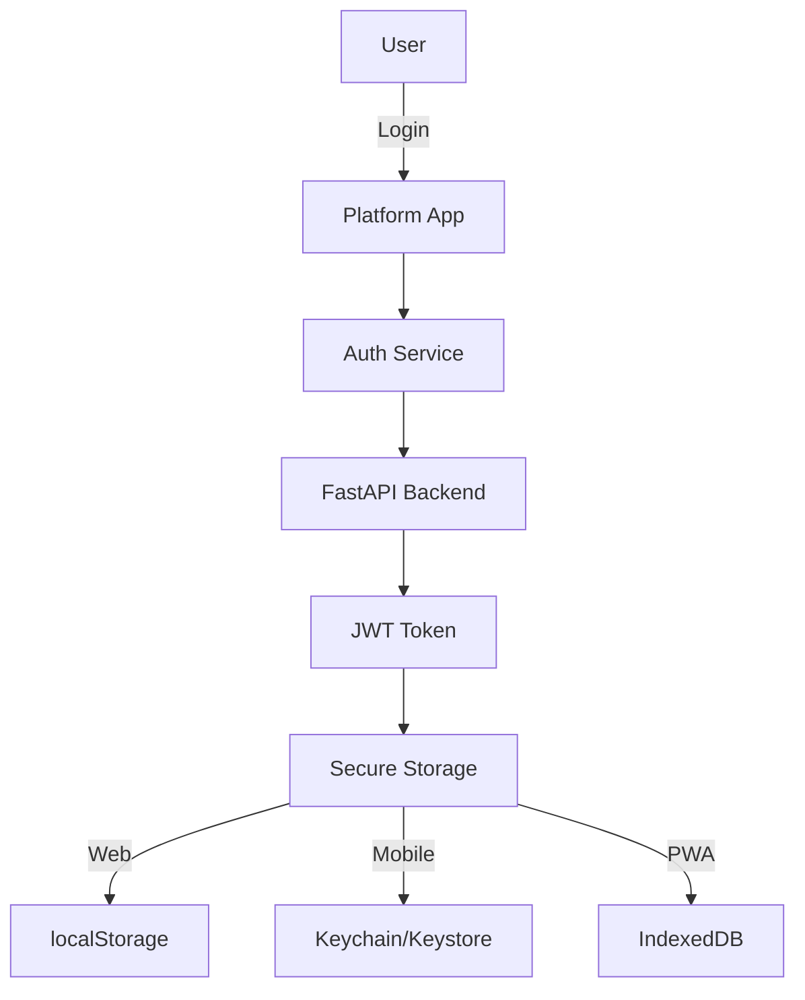

# 🏗️ RAG Enterprise - Multi-Platform Architecture & Strategy

## 📊 Current State Analysis

### Existing Frontend Structures
```
├── frontend/               # Phase 1-10 HTML/JS (Legacy)
│   ├── login.html
│   ├── register.html
│   ├── analytics-dashboard.html
│   └── js/
│       ├── dark-mode.js
│       ├── i18n.js
│       ├── notifications.js
│       └── recommendations.js
│
├── frontend-v2/           # Next.js 14 App Router (Modern)
│   ├── app/
│   ├── components/
│   ├── contexts/
│   └── hooks/
│
├── mobile/
│   ├── pwa/              # Progressive Web App
│   │   └── login.html
│   ├── react-native/     # React Native App
│   │   └── src/screens/
│   └── service-worker.js
│
└── app/static/           # FastAPI Static Files
    └── index.html
```

### Problems to Solve
1. **Code Duplication**: Multiple login/register implementations
2. **Inconsistent Tech Stack**: HTML/JS vs React vs Next.js
3. **No Shared Components**: Each platform has separate code
4. **Complex Maintenance**: Updates needed in 4+ places
5. **No Unified State Management**: Different auth systems

## 🎯 Target Architecture - Monorepo Structure

```
rag-enterprise/
├── apps/                       # 🚀 Applications
│   ├── web/                   # Next.js 14 Web App
│   │   ├── app/
│   │   ├── public/
│   │   └── package.json
│   │
│   ├── mobile/                # React Native App
│   │   ├── ios/
│   │   ├── android/
│   │   ├── src/
│   │   └── package.json
│   │
│   ├── pwa/                   # Progressive Web App
│   │   ├── src/
│   │   ├── manifest.json
│   │   └── package.json
│   │
│   └── api/                   # FastAPI Backend
│       ├── app/
│       ├── requirements.txt
│       └── Dockerfile
│
├── packages/                   # 📦 Shared Packages
│   ├── ui/                    # UI Component Library
│   │   ├── src/
│   │   │   ├── components/
│   │   │   ├── layouts/
│   │   │   └── themes/
│   │   └── package.json
│   │
│   ├── core/                  # Business Logic
│   │   ├── src/
│   │   │   ├── auth/
│   │   │   ├── api/
│   │   │   └── utils/
│   │   └── package.json
│   │
│   ├── mobile-ui/             # React Native Components
│   │   ├── src/
│   │   └── package.json
│   │
│   └── config/                # Shared Configuration
│       ├── eslint/
│       ├── tsconfig/
│       └── tailwind/
│
├── infrastructure/            # 🛠️ Infrastructure
│   ├── docker/
│   ├── kubernetes/
│   └── terraform/
│
├── docs/                      # 📚 Documentation
├── scripts/                   # 🔧 Build & Deploy Scripts
├── turbo.json                 # Turborepo Config
├── pnpm-workspace.yaml        # PNPM Workspace
└── package.json              # Root Package
```

## 🔄 Migration Strategy

### Phase 1: Setup Monorepo (Week 1)
```bash
# 1. Initialize Turborepo
npx create-turbo@latest

# 2. Setup PNPM Workspaces
pnpm init
pnpm add -D turbo

# 3. Configure workspace
cat > pnpm-workspace.yaml << EOF
packages:
  - 'apps/*'
  - 'packages/*'
EOF
```

### Phase 2: Extract Shared Components (Week 2)
1. **Identify Common Components**
   - Authentication forms
   - Navigation
   - Data tables
   - Charts
   - Search interfaces

2. **Create @rag/ui Package**
   ```typescript
   // packages/ui/src/components/auth/LoginForm.tsx
   export const LoginForm = ({ onSubmit, platform }) => {
     // Unified login component
   }
   ```

3. **Create @rag/core Package**
   ```typescript
   // packages/core/src/auth/authService.ts
   export class AuthService {
     async login(credentials) { }
     async register(userData) { }
     async refreshToken() { }
   }
   ```

### Phase 3: Migrate Platforms (Week 3-4)

#### Web App (Next.js)
```typescript
// apps/web/app/layout.tsx
import { ThemeProvider } from '@rag/ui/themes'
import { AuthProvider } from '@rag/core/auth'

export default function RootLayout({ children }) {
  return (
    <html>
      <body>
        <ThemeProvider>
          <AuthProvider>
            {children}
          </AuthProvider>
        </ThemeProvider>
      </body>
    </html>
  )
}
```

#### Mobile App (React Native)
```typescript
// apps/mobile/src/App.tsx
import { NavigationContainer } from '@react-navigation/native'
import { AuthProvider } from '@rag/core/auth'
import { MobileTheme } from '@rag/mobile-ui/themes'

export default function App() {
  return (
    <NavigationContainer theme={MobileTheme}>
      <AuthProvider>
        <AppNavigator />
      </AuthProvider>
    </NavigationContainer>
  )
}
```

#### PWA
```typescript
// apps/pwa/src/index.tsx
import { registerServiceWorker } from './serviceWorker'
import { App } from '@rag/ui/app'

// Enable PWA features
registerServiceWorker()

// Use shared components
ReactDOM.render(<App mode="pwa" />, document.getElementById('root'))
```

## 🚀 Platform-Specific Features

### Web App (Next.js)
- **SSR/SSG**: SEO optimization
- **Edge Functions**: API routes
- **Incremental Static Regeneration**
- **Image Optimization**
- **Advanced Routing**

### Mobile App (React Native)
- **Native Modules**: Camera, GPS, Biometrics
- **Push Notifications**
- **Offline First**
- **Deep Linking**
- **App Store Deployment**

### PWA
- **Service Worker**: Offline support
- **App Shell Architecture**
- **Background Sync**
- **Install Prompts**
- **Web Push Notifications**

## 📱 Responsive Design Strategy

### Breakpoints
```typescript
// packages/ui/src/themes/breakpoints.ts
export const breakpoints = {
  mobile: '0px',      // 0-639px
  tablet: '640px',    // 640-1023px
  laptop: '1024px',   // 1024-1439px
  desktop: '1440px',  // 1440px+
}
```

### Component Variants
```typescript
// packages/ui/src/components/DataTable.tsx
export const DataTable = ({ data, variant = 'responsive' }) => {
  if (variant === 'mobile') {
    return <MobileCardList data={data} />
  }

  return (
    <div className="hidden sm:block">
      <DesktopTable data={data} />
    </div>
  )
}
```

## 🔐 Unified Authentication

### Auth Flow


### Implementation
```typescript
// packages/core/src/auth/storage.ts
export class AuthStorage {
  private strategy: StorageStrategy

  constructor(platform: Platform) {
    this.strategy = this.getStrategy(platform)
  }

  private getStrategy(platform: Platform): StorageStrategy {
    switch(platform) {
      case 'web':
        return new LocalStorageStrategy()
      case 'mobile':
        return new SecureStorageStrategy()
      case 'pwa':
        return new IndexedDBStrategy()
    }
  }

  async saveToken(token: string) {
    return this.strategy.save('auth_token', token)
  }
}
```

## 🔄 State Management

### Zustand + React Query
```typescript
// packages/core/src/stores/authStore.ts
import { create } from 'zustand'
import { persist } from 'zustand/middleware'

export const useAuthStore = create(
  persist(
    (set) => ({
      user: null,
      token: null,
      login: async (credentials) => {
        const response = await authApi.login(credentials)
        set({ user: response.user, token: response.token })
      },
      logout: () => set({ user: null, token: null })
    }),
    {
      name: 'auth-storage',
      storage: createPlatformStorage()
    }
  )
)
```

## 🎨 Design System

### Theming
```typescript
// packages/ui/src/themes/index.ts
export const themes = {
  light: {
    primary: '#3B82F6',
    background: '#FFFFFF',
    text: '#1F2937'
  },
  dark: {
    primary: '#60A5FA',
    background: '#111827',
    text: '#F9FAFB'
  }
}

// Platform-specific overrides
export const platformThemes = {
  web: { ...themes },
  mobile: {
    ...themes,
    spacing: { ...mobileSpacing }
  },
  pwa: { ...themes }
}
```

## 🚢 Deployment Strategy

### Web App
```yaml
# .github/workflows/deploy-web.yml
name: Deploy Web App
on:
  push:
    branches: [main]
    paths: ['apps/web/**']

jobs:
  deploy:
    runs-on: ubuntu-latest
    steps:
      - uses: actions/checkout@v3
      - run: pnpm install
      - run: pnpm build --filter=web
      - run: pnpm deploy:vercel
```

### Mobile App
```yaml
# .github/workflows/deploy-mobile.yml
name: Deploy Mobile App
on:
  push:
    tags: ['mobile-v*']

jobs:
  ios:
    runs-on: macos-latest
    steps:
      - run: pnpm build:ios
      - run: fastlane ios release

  android:
    runs-on: ubuntu-latest
    steps:
      - run: pnpm build:android
      - run: fastlane android release
```

### PWA
```yaml
# .github/workflows/deploy-pwa.yml
name: Deploy PWA
on:
  push:
    branches: [main]
    paths: ['apps/pwa/**']

jobs:
  deploy:
    runs-on: ubuntu-latest
    steps:
      - run: pnpm build --filter=pwa
      - run: pnpm deploy:cloudflare
```

## 📊 Performance Targets

### Web Vitals
- **LCP**: < 2.5s
- **FID**: < 100ms
- **CLS**: < 0.1
- **TTI**: < 3.8s

### Mobile Performance
- **App Size**: < 20MB (Android), < 30MB (iOS)
- **Startup Time**: < 2s
- **Memory Usage**: < 150MB
- **Battery Impact**: < 5% per hour

### PWA Metrics
- **Offline Load**: < 1s
- **Cache Hit Rate**: > 80%
- **Install Conversion**: > 10%

## 🔧 Development Workflow

### Commands
```json
{
  "scripts": {
    "dev": "turbo run dev",
    "dev:web": "turbo run dev --filter=web",
    "dev:mobile": "turbo run dev --filter=mobile",
    "dev:pwa": "turbo run dev --filter=pwa",
    "build": "turbo run build",
    "test": "turbo run test",
    "lint": "turbo run lint",
    "type-check": "turbo run type-check"
  }
}
```

### Git Workflow
```bash
# Feature branches
feature/web-<feature>
feature/mobile-<feature>
feature/pwa-<feature>
feature/shared-<feature>

# Commit convention
feat(web): add dashboard
fix(mobile): resolve navigation issue
chore(shared): update dependencies
```

## 🎯 Success Metrics

### Technical KPIs
- **Code Reuse**: > 60%
- **Build Time**: < 5 minutes
- **Test Coverage**: > 80%
- **Bundle Size Reduction**: > 30%

### Business KPIs
- **Development Velocity**: +40%
- **Bug Rate**: -50%
- **Time to Market**: -30%
- **User Satisfaction**: +25%

## 📅 Timeline

### Month 1
- Week 1: Monorepo setup
- Week 2: Shared packages
- Week 3-4: Web migration

### Month 2
- Week 1-2: Mobile migration
- Week 3-4: PWA migration

### Month 3
- Week 1-2: Testing & optimization
- Week 3-4: Deployment & monitoring

## 🚀 Next Steps

1. **Immediate Actions**
   - Setup Turborepo
   - Create shared packages structure
   - Begin component extraction

2. **Short Term (2 weeks)**
   - Migrate authentication
   - Setup CI/CD pipelines
   - Create design system

3. **Long Term (3 months)**
   - Complete platform migrations
   - Implement advanced features
   - Performance optimization

---

**Last Updated**: November 2024
**Version**: 1.0.0
**Status**: Planning Phase