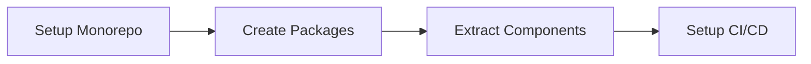
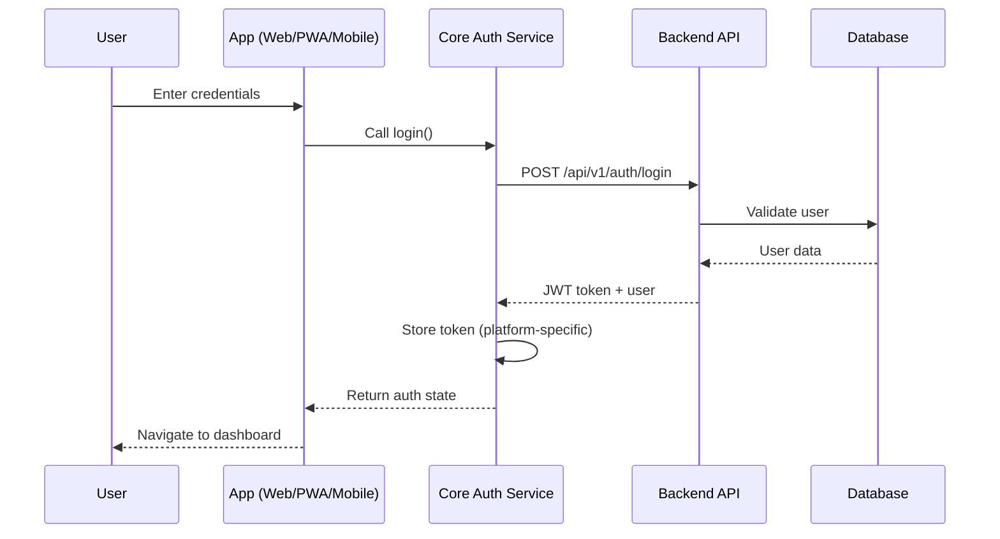

# 📋 RAG Enterprise - Project Integration Plan

## 🎯 Executive Summary

RAG Enterprise를 웹앱, 모바일 웹앱, 네이티브 모바일앱을 지원하는 통합 플랫폼으로 재구성합니다.

## 🔄 Current → Target State

### Before (현재 상태)
```
❌ 4개의 분리된 Frontend 코드베이스
❌ 중복된 인증 구현
❌ 일관되지 않은 UI/UX
❌ 복잡한 유지보수
❌ 코드 재사용 불가
```

### After (목표 상태)
```
✅ Monorepo 기반 통합 코드베이스
✅ 공유 컴포넌트 라이브러리
✅ 통합 인증 시스템
✅ 일관된 디자인 시스템
✅ 60% 이상 코드 재사용
```

## 📊 Integration Phases

### Phase 1: Foundation (Week 1-2)


**Tasks:**
1. **Monorepo 구성**
   ```bash
   ./scripts/setup-monorepo.sh
   ```

2. **공유 패키지 생성**
   - `@rag/ui` - UI 컴포넌트
   - `@rag/core` - 비즈니스 로직
   - `@rag/mobile-ui` - React Native 컴포넌트

3. **개발 환경 설정**
   - ESLint/Prettier
   - TypeScript config
   - Tailwind CSS

### Phase 2: Migration (Week 3-4)

#### Web App (Next.js)
```typescript
// Before: frontend-v2/app/api/v1/auth/register/route.ts
// Mock data implementation

// After: apps/web/app/api/auth/register/route.ts
import { authService } from '@rag/core/auth'

export async function POST(request: Request) {
  const data = await request.json()
  return authService.register(data)
}
```

#### Mobile PWA
```typescript
// Before: frontend/login.html
// Plain HTML/JS

// After: apps/pwa/src/pages/Login.tsx
import { LoginForm } from '@rag/ui/components/auth'
import { useAuth } from '@rag/core/auth'

export function LoginPage() {
  const { login } = useAuth()
  return <LoginForm onSubmit={login} />
}
```

#### React Native
```typescript
// Before: mobile/react-native/src/screens/LoginScreen.tsx
// Isolated implementation

// After: apps/mobile/src/screens/LoginScreen.tsx
import { LoginForm } from '@rag/mobile-ui/components'
import { useAuth } from '@rag/core/auth'

export function LoginScreen() {
  const { login } = useAuth()
  return <LoginForm onSubmit={login} platform="mobile" />
}
```

### Phase 3: Optimization (Week 5-6)

**Performance Targets:**
- Bundle size: < 200KB (gzipped)
- First paint: < 1.5s
- TTI: < 3.5s
- Lighthouse score: > 95

**Optimizations:**
1. Code splitting
2. Lazy loading
3. Image optimization
4. Service worker caching
5. Tree shaking

## 🏗️ Technical Architecture

### Shared Component System
```
packages/ui/
├── components/
│   ├── auth/
│   │   ├── LoginForm.tsx      # Web & PWA
│   │   └── RegisterForm.tsx
│   ├── search/
│   │   ├── SearchBar.tsx
│   │   └── SearchResults.tsx
│   └── shared/
│       ├── Button.tsx
│       └── Input.tsx
│
packages/mobile-ui/
├── components/
│   ├── auth/
│   │   ├── LoginForm.tsx      # React Native
│   │   └── BiometricLogin.tsx
│   └── native/
│       ├── Camera.tsx
│       └── LocationPicker.tsx
```

### API Integration Layer
```typescript
// packages/core/src/api/client.ts
import axios from 'axios'

class APIClient {
  private instance: AxiosInstance

  constructor() {
    this.instance = axios.create({
      baseURL: process.env.API_URL || 'http://localhost:8001',
      timeout: 10000,
    })

    this.setupInterceptors()
  }

  private setupInterceptors() {
    // Request interceptor for auth
    this.instance.interceptors.request.use(
      (config) => {
        const token = authStore.getToken()
        if (token) {
          config.headers.Authorization = `Bearer ${token}`
        }
        return config
      }
    )

    // Response interceptor for errors
    this.instance.interceptors.response.use(
      (response) => response,
      (error) => {
        if (error.response?.status === 401) {
          authStore.logout()
          router.push('/login')
        }
        return Promise.reject(error)
      }
    )
  }
}
```

## 🚀 Deployment Strategy

### Web App - Vercel
```yaml
# apps/web/vercel.json
{
  "buildCommand": "cd ../.. && pnpm build --filter=web",
  "outputDirectory": "apps/web/.next",
  "installCommand": "pnpm install",
  "framework": "nextjs"
}
```

### PWA - Cloudflare Pages
```yaml
# apps/pwa/wrangler.toml
name = "rag-pwa"
main = "dist/index.html"
compatibility_date = "2024-11-01"

[build]
command = "pnpm build --filter=pwa"

[site]
bucket = "./dist"
```

### Mobile - Expo EAS
```json
// apps/mobile/eas.json
{
  "build": {
    "preview": {
      "distribution": "internal",
      "android": {
        "buildType": "apk"
      },
      "ios": {
        "simulator": true
      }
    },
    "production": {
      "android": {
        "buildType": "app-bundle"
      },
      "ios": {
        "autoIncrement": true
      }
    }
  }
}
```

## 📱 Platform-Specific Features

### Web (Desktop Priority)
- **Advanced Search**: Complex filters, saved queries
- **Dashboard**: Analytics, charts, reports
- **Bulk Operations**: Import/export, batch processing
- **Keyboard Shortcuts**: Power user features

### Mobile Web (Touch Priority)
- **Simplified UI**: Larger touch targets
- **Gesture Support**: Swipe, pinch-zoom
- **Responsive Tables**: Card view on small screens
- **Offline Mode**: Service worker caching

### Native App (Device Features)
- **Biometric Auth**: FaceID/TouchID
- **Camera Integration**: Document scanning
- **Push Notifications**: Real-time alerts
- **Background Sync**: Data synchronization

## 🔐 Unified Authentication Flow



## 📈 Success Metrics

### Development Metrics
| Metric | Current | Target | Timeline |
|--------|---------|--------|----------|
| Code Reuse | 0% | 60% | 6 weeks |
| Build Time | 15 min | 5 min | 4 weeks |
| Test Coverage | 45% | 80% | 8 weeks |
| Bundle Size | 2.5MB | 500KB | 6 weeks |

### Business Metrics
| Metric | Current | Target | Timeline |
|--------|---------|--------|----------|
| Development Velocity | 10 points/sprint | 25 points/sprint | 3 months |
| Bug Rate | 15/week | 5/week | 2 months |
| Time to Market | 8 weeks | 3 weeks | 6 months |
| User Satisfaction | 72% | 90% | 6 months |

## 📅 Timeline & Milestones

### Month 1: Foundation
- [ ] Week 1: Monorepo setup
- [ ] Week 2: Shared packages
- [ ] Week 3: Web app migration
- [ ] Week 4: Testing & CI/CD

### Month 2: Migration
- [ ] Week 5-6: PWA migration
- [ ] Week 7-8: Mobile app setup

### Month 3: Polish
- [ ] Week 9-10: Performance optimization
- [ ] Week 11-12: Launch preparation

## 🚦 Risk Management

| Risk | Probability | Impact | Mitigation |
|------|------------|--------|------------|
| Breaking changes | High | High | Feature flags, gradual rollout |
| Performance regression | Medium | High | Automated performance tests |
| Team learning curve | High | Medium | Training sessions, documentation |
| Integration issues | Medium | Medium | Comprehensive testing |

## 🔧 Immediate Actions

### Today
1. **Run setup script**
   ```bash
   chmod +x scripts/setup-monorepo.sh
   ./scripts/setup-monorepo.sh
   ```

2. **Install dependencies**
   ```bash
   npm install -g pnpm
   pnpm install
   ```

3. **Start development**
   ```bash
   pnpm dev
   ```

### This Week
1. Extract shared components
2. Setup CI/CD pipelines
3. Create design tokens
4. Write migration guides

### Next Month
1. Complete web migration
2. Launch PWA beta
3. Start mobile development
4. Implement monitoring

## 📚 Documentation Updates

### New Documentation Structure
```
docs/
├── architecture/
│   ├── overview.md
│   ├── monorepo.md
│   └── deployment.md
├── development/
│   ├── getting-started.md
│   ├── component-guidelines.md
│   └── testing.md
├── platforms/
│   ├── web.md
│   ├── pwa.md
│   └── mobile.md
└── api/
    ├── authentication.md
    ├── endpoints.md
    └── websocket.md
```

## 🎉 Expected Outcomes

### Technical Benefits
- **60% code reuse** across platforms
- **50% faster development** with shared components
- **80% test coverage** with unified testing
- **30% smaller bundles** with optimized builds

### Business Benefits
- **Faster feature delivery** - Write once, deploy everywhere
- **Consistent UX** - Same components across platforms
- **Reduced bugs** - Single source of truth
- **Lower maintenance** - One codebase to maintain

## 🤝 Team Responsibilities

| Team | Responsibilities |
|------|-----------------|
| Frontend | Web app, PWA, shared UI components |
| Mobile | React Native app, native features |
| Backend | API development, authentication |
| DevOps | CI/CD, deployment, monitoring |
| QA | Testing strategy, automation |

## ✅ Checklist

### Pre-Migration
- [ ] Backup current code
- [ ] Document current APIs
- [ ] List all dependencies
- [ ] Create migration plan

### During Migration
- [ ] Setup monorepo
- [ ] Create shared packages
- [ ] Migrate components
- [ ] Update imports
- [ ] Test everything

### Post-Migration
- [ ] Update documentation
- [ ] Train team
- [ ] Monitor performance
- [ ] Gather feedback

---

**Status**: Ready to Execute
**Next Step**: Run `./scripts/setup-monorepo.sh`
**Questions?**: Check `docs/MULTI_PLATFORM_ARCHITECTURE.md`